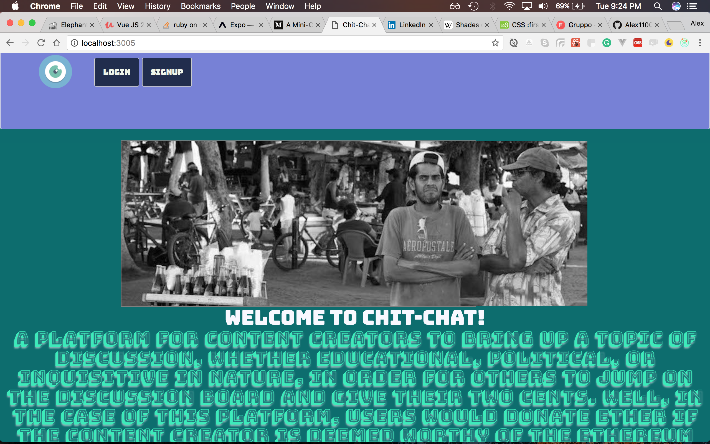
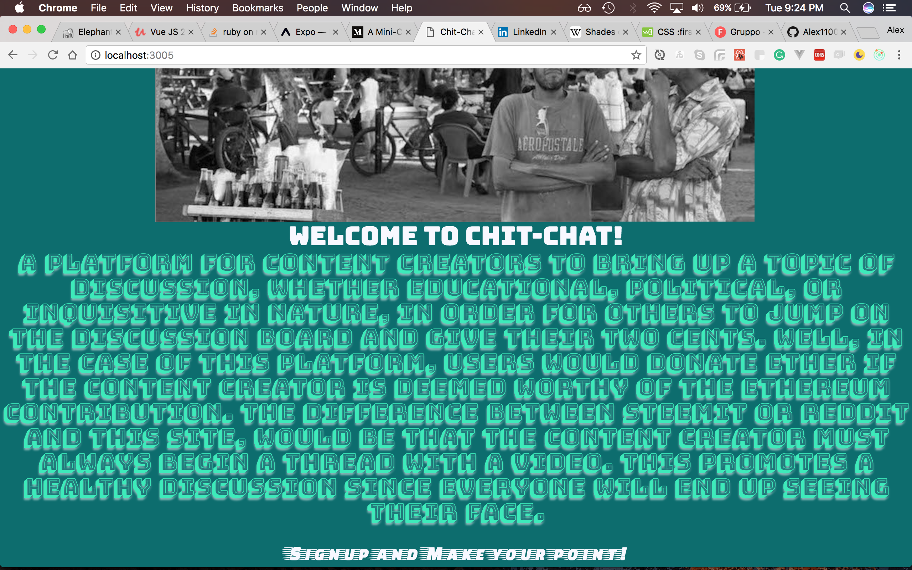
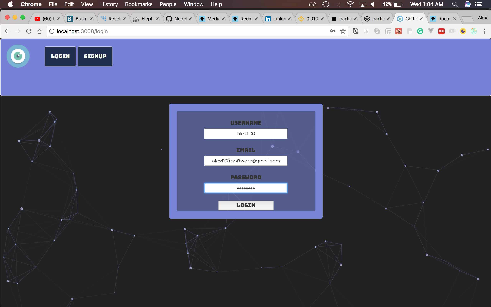
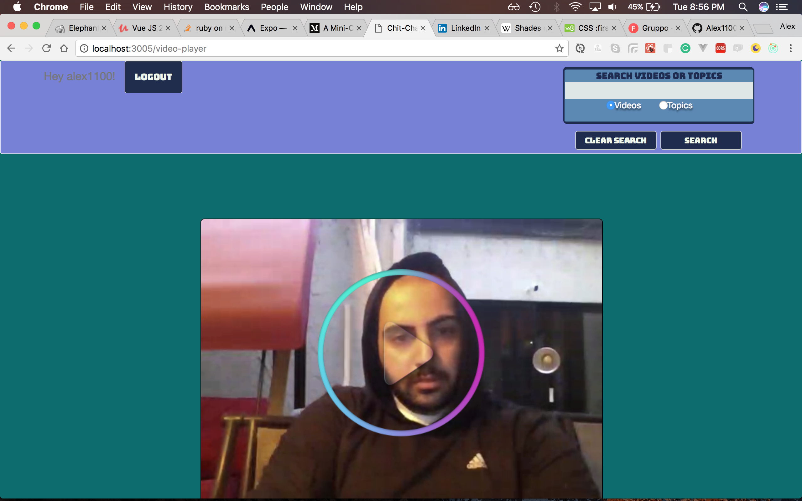
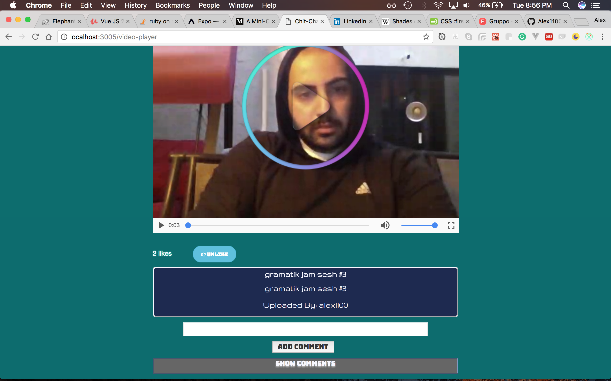
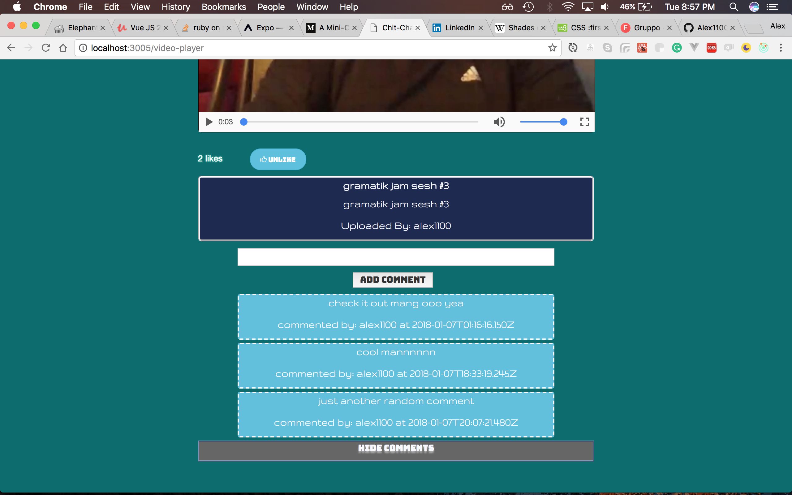

## Chit-Chat

# A platform for content creators to bring up a topic of discussion, whether educational, political, or inquisitive in nature, in order for others to jump on the discussion board and give their two cents. Well, in the case of this platform, Users would donate ether if the content creator is deemed worthy of the Ethereum contribution. The difference between Steemit or Reddit and this site, would be that the content creator must always begin a thread with a Video. This promotes a healthy discussion since everyone will end up seeing their face.

## LANDING PAGE

## LOGIN PAGE / SIGNUP PAGE

## VIDEO PLAYER PAGE

## Technologies
- Node.js
- React.js
- Redux.js
- Redux Persist
- Axios
- Cors
- Webpack
- ES6-ES8
- Gulp
- Bcrypt
- JWT
- Sequelize
- PostgreSQL
- <a href="https://github.com/Alex1100/chit_chat_api">Ruby on Rails Microservice API for Polymorphic Comments</a>
- Content Liking/Unliking
- WebRTC API via RecordRTC for creating videos

## SOON TO INCORPORATE
- Ethereum donations via Infura API and Web3
- Bitcoin donations via npm modules
- EOS donations once EOS mainnet is live in Summer/Fall 2018
- Cryptocurrency donations for flagging malicious or fraudulent users/user content
- User following/subscribing
- Update react code to fetch users who commented on a given comment too
- Edit Profile Page for User
- Edit Video Page for editing description/title/topic
- Random Video Feature
- Finish Search Feature (already tracking whether user searched for videos or topics)
- Style Add Topic and Topic Component
